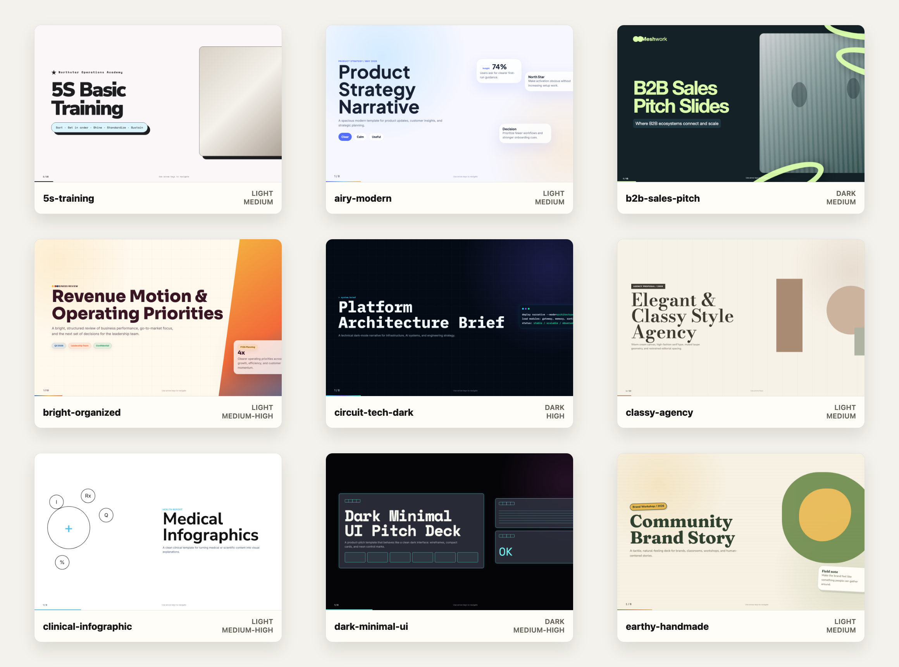
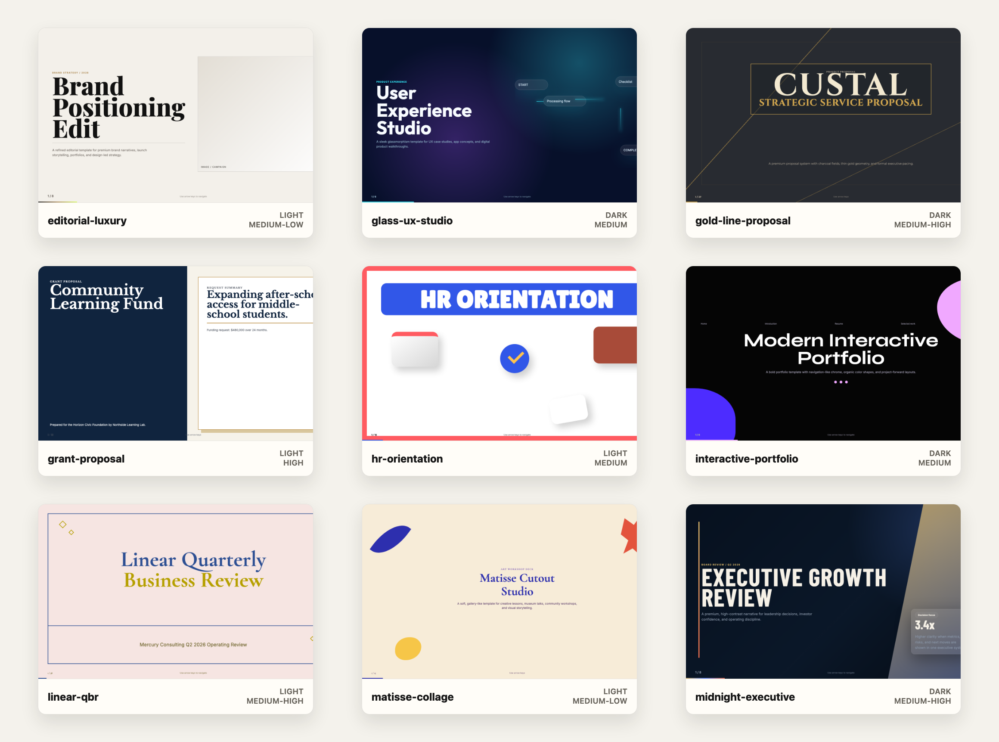
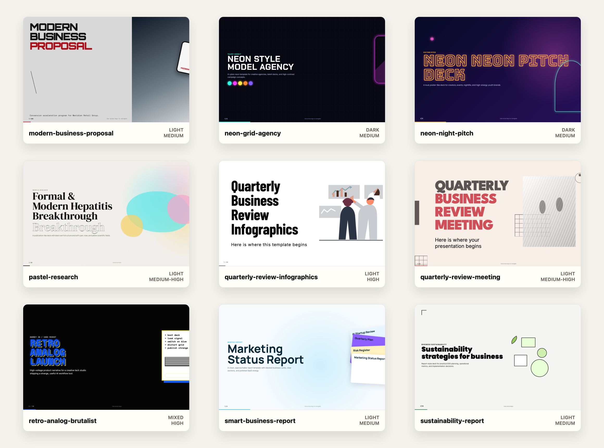
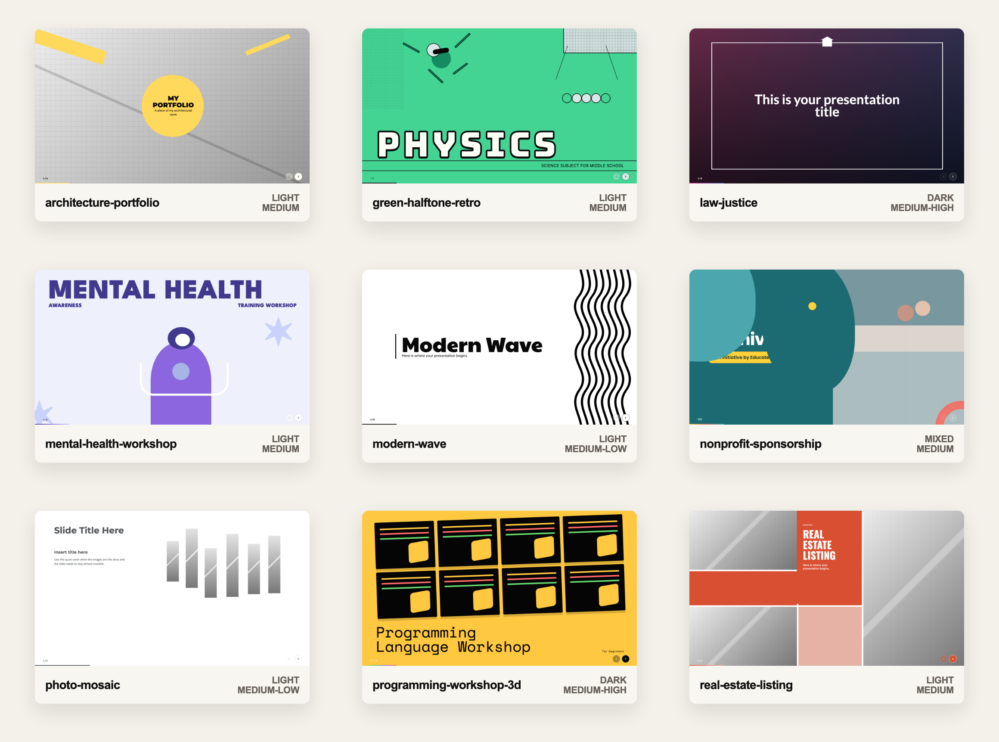
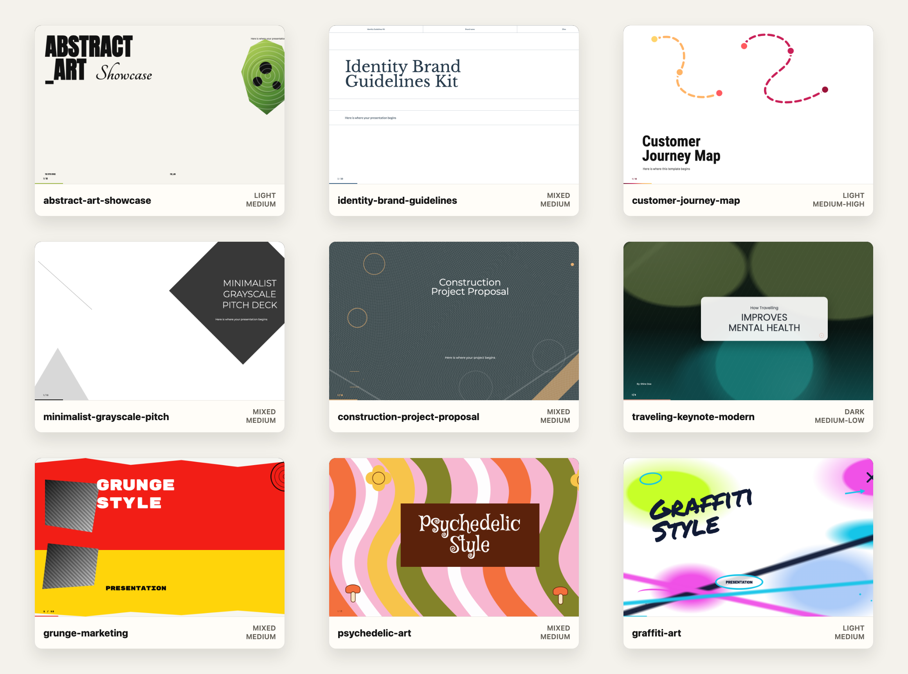
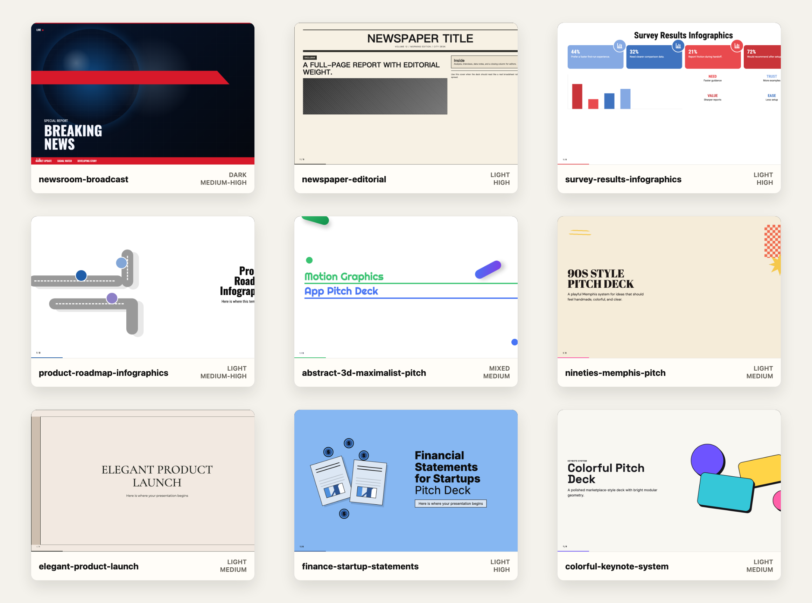

# AI Slide Templates

Self-contained HTML slide templates for AI-assisted deck generation.

Each template is a folder under `templates/` with a runnable HTML deck and a JSON metadata file. Agents select templates by scanning `templates/*/template.json`, then clone and adapt the chosen `template.html` for the user's real deck.

## Recommended: Use The Skill

Install this repository's skill into a Skills-compatible agent:

```bash
npx skills add https://github.com/cogine-ai/ai-slide-templates --skill ai-slide-templates
```

Then ask your agent to use it:

```txt
Use $ai-slide-templates to turn my content into a finished browser-openable HTML slide deck.
```

The skill guides the agent to clone this repository, read `AGENTS.md`, use `INPUT_GUIDE.md` when the source material needs shaping, choose a template from `templates/*/template.json`, adapt the chosen `template.html`, and verify the finished deck.

If your team already installs the Cogine development skill collection, the same skill is also available there:

```bash
npx skills add https://github.com/cogine-ai/cogine-dev-skillset --skill ai-slide-templates
```

## Template Gallery

Browse 54 browser-openable HTML slide templates across business, research, training, creative, education, nonprofit, real estate, travel, brand, and executive presentation styles.













## Manual Agent Prompt

If your agent does not support Skills yet, copy this prompt into your AI coding agent:

```txt
Clone https://github.com/cogine-ai/ai-slide-templates and read AGENTS.md before you start. This repo is a library of self-contained HTML slide templates for AI-assisted deck generation. Treat AGENTS.md as the authoritative workflow: use it to select a template, preview options, preserve the chosen template's design system, and produce a finished browser-openable HTML deck from my content.
```

For better results, read [INPUT_GUIDE.md](INPUT_GUIDE.md) before asking an agent to build a deck. It explains what content to provide, how to brief audience and tone, and when the agent should synthesize an outline first.

## Examples

See [`examples/`](examples/) for end-to-end workflow examples that show the input, metadata-based template selection, derived deck outline, generated output structure, and common failure modes.

- [`structured-outline-to-output.md`](examples/structured-outline-to-output.md): a structured outline turned into a metric-led business review deck.
- [`raw-notes-to-output.md`](examples/raw-notes-to-output.md): long script/raw notes compressed into a clear product research deck.

## Structure

```txt
skills/
  ai-slide-templates/
    SKILL.md
templates/
  <slug>/
    template.html
    template.json
schema/
  template.schema.json
```

The folder name must match `template.json.slug`.

## Current Templates

| Template | Tone | Best For |
|---|---|---|
| `5s-training` | Soft, procedural, practical | 5S training, operations workshops, process improvement, team enablement |
| `abstract-3d-maximalist-pitch` | Chunky, kinetic, playful | App pitch decks, motion-graphics concepts, creator product stories, and bold feature launches |
| `abstract-art-showcase` | Editorial, curatorial, expressive | Art showcases, gallery reports, cultural programming, creative brand concepts, abstract visual narratives |
| `airy-modern` | Minimal, friendly, optimistic | Product strategy, customer research, startup updates, planning workshops |
| `architecture-portfolio` | Architectural, clean, structured | Architecture portfolios, design studio credentials, floor-plan narratives, and built-environment project reviews |
| `b2b-sales-pitch` | Sharp, fresh, corporate | B2B sales pitches, SaaS proposals, enterprise partnership decks, GTM stories |
| `bright-organized` | Warm, structured, practical | Business reviews, operating plans, team kickoffs, client proposals |
| `classy-agency` | Elegant, restrained, geometric | Agency proposals, brand strategy, consulting-lite service pitches |
| `clinical-infographic` | Clinical, clear, diagrammatic | Medical reports, research explainers, clinical training, science briefs |
| `colorful-keynote-system` | Bright, modular, punchy | Colorful pitch decks, keynote systems, modular startup stories, and visual strategy recaps |
| `construction-project-proposal` | Formal, precise, structured | Construction proposals, engineering plans, architecture delivery, site reviews, built-environment procurement |
| `circuit-tech-dark` | Technical, sharp, engineering-led | Architecture reviews, platform pitches, AI product strategy, developer launches |
| `customer-journey-map` | Diagrammatic, direct, structured | Customer journey maps, service-design workshops, lifecycle strategy, product discovery |
| `dark-minimal-ui` | Digital, precise, interface-led | Startup pitches, UI product demos, technology concepts |
| `earthy-handmade` | Handmade, approachable, story-led | Brand manifestos, community workshops, classroom kickoffs, nonprofit stories |
| `editorial-luxury` | Luxury, minimal, art-directed | Premium brand strategy, portfolio presentations, creative direction, launch narratives |
| `elegant-product-launch` | Refined, editorial, premium | Product launches, campaign plans, premium retail stories, and art-directed launch narratives |
| `finance-startup-statements` | Practical, numeric, hand-drawn | Startup financial statements, funding asks, budget briefs, and simple financial education decks |
| `glass-ux-studio` | Sleek, digital, experiential | UX case studies, product walkthroughs, app concepts, innovation pitches |
| `gold-line-proposal` | Premium, dark, authoritative | Project proposals, executive concepts, premium service pitches |
| `graffiti-art` | Loud, rough, graphic | Youth culture pitches, graffiti-inspired campaigns, art workshops, community event decks |
| `grant-proposal` | Formal, institutional, evidence-led | Grant proposals, nonprofit funding requests, foundation applications, program plans |
| `green-halftone-retro` | Energetic, diagrammatic, classroom-ready | Middle-school science lessons, STEM workshops, experiment explainers, classroom agendas, quiz boards, and playful technical training |
| `grunge-marketing` | Gritty, collaged, bold | Marketing campaigns, music brand pitches, launch concepts, streetwear decks |
| `hr-orientation` | Bright, playful, supportive | HR orientation, new-hire onboarding, culture introductions, internal training |
| `identity-brand-guidelines` | Polished, documented, restrained | Brand guidelines, identity systems, logo usage, palette documentation, creative governance |
| `interactive-portfolio` | Visual, playful, curated | Portfolio reviews, agency credentials, creative case studies |
| `law-justice` | Measured, legal, traditional | Legal briefings, justice policy updates, public institution presentations, and law education decks |
| `linear-qbr` | Restrained, linear, formal | Quarterly business reviews, board updates, operating cadence, portfolio reviews |
| `matisse-collage` | Artistic, soft, gallery-like | Creative workshops, art education, museum talks, community programs |
| `mental-health-workshop` | Warm, safe, friendly | Mental health workshops, HR wellbeing training, support briefings, and campus awareness sessions |
| `midnight-executive` | Executive, polished, dramatic | Board updates, investor briefings, leadership reviews, strategic reviews |
| `minimalist-grayscale-pitch` | Clean, quiet, precise | Startup pitch decks, founder narratives, investor updates, restrained business plans |
| `modern-wave` | Playful, clean, high-contrast | Simple modern keynotes, introductions, creative overviews, quotes, and lightweight visual storytelling |
| `modern-business-proposal` | Bold, techno, sales-led | Modern business proposals, client pitches, service offers, project plans |
| `neon-grid-agency` | Neon, graphic, energetic | Creative agency pitches, talent decks, youth brand campaigns |
| `neon-night-pitch` | Expressive, loud, pop | Event pitches, creator decks, nightlife and culture proposals |
| `newspaper-editorial` | Editorial, printed, archival | Newspaper-style reports, classroom publishing, editorial summaries, and issue-style narratives |
| `newsroom-broadcast` | Urgent, broadcast, high-contrast | Breaking-news briefings, live updates, crisis rooms, and fast executive bulletins |
| `nineties-memphis-pitch` | Retro, handmade, playful | 90s-style pitch decks, youth campaigns, music or culture concepts, and casual creative proposals |
| `nonprofit-sponsorship` | Inviting, clear, mission-led | Nonprofit event sponsorship decks, community partnership proposals, fundraising packages, and sponsor benefit explainers |
| `pastel-research` | Scholarly, gentle, polished | Academic talks, medical science updates, conference presentations |
| `photo-mosaic` | Gallery-like, polished, image-led | Photo-heavy case studies, visual portfolios, travel stories, project galleries, and product moodboards |
| `product-roadmap-infographics` | Clean, directional, infographic | Product roadmaps, release plans, milestone reviews, and roadmap workshops |
| `programming-workshop-3d` | Hands-on, digital, energetic | Developer training, coding bootcamps, technical onboarding, and beginner programming lessons |
| `psychedelic-art` | Maximal, fluid, retro | Music events, creative concepts, brand activations, culture decks |
| `quarterly-review-infographics` | Direct, metric-led, practical | Quarterly business reviews, performance reports, sales updates, executive dashboards |
| `quarterly-review-meeting` | Clear, measured, professional | QBR meetings, operating updates, project reviews, status and RAID reports |
| `real-estate-listing` | Sales-led, direct, polished | Property listing decks, real-estate agency profiles, service/product pages, and neighborhood market summaries |
| `retro-analog-brutalist` | Brutalist, high-contrast, experimental | Creative tech launches, digital marketing pitches, bold product stories |
| `smart-business-report` | Friendly, clear, businesslike | Marketing status reports, SaaS reviews, quarterly business updates |
| `survey-results-infographics` | Clear, statistical, infographic | Survey results, research summaries, customer feedback reports, and workshop readouts |
| `sustainability-report` | Clear, operational, report-like | Sustainability strategies, ESG reports, operating plans, impact reviews |
| `traveling-keynote-modern` | Modern, cinematic, warm | Travel keynotes, destination stories, tour concepts, wellness travel presentations |

## Template Rules

- `template.html` should be a single-file HTML document that can open directly in a browser.
- Inline CSS is preferred so templates remain portable when cloned.
- Small inline JavaScript is allowed for navigation, progress, or demo behavior.
- `template.json` is the only metadata source of truth.
- Do not add a hand-maintained central index. If a catalog is needed later, generate it from `templates/*/template.json`.
- Do not standardize fonts across templates. Typography is part of each template's identity and should follow the source-inspired style as closely as practical.
- Sample content should be realistic presentation content, not lorem ipsum.

## Validation

Run:

```sh
node scripts/validate.mjs
```

The validator checks that every template folder has `template.html` and `template.json`, the folder name matches `slug`, required metadata fields exist, `.deck` is present, and `slide_count` matches the HTML slide count.
It also checks common metadata drift: enum values, feature object shape, source attribution shape, and whether declared palette colors and font families are present in the template HTML.

Optional heavier visual/runtime validation is separate so the structural validator stays fast:

```sh
node scripts/validate-visual.mjs
node scripts/validate-visual.mjs --template airy-modern
```

The visual validator launches a local Chrome/Chromium-compatible browser at a 16:9 `1280x720` viewport. It checks browser console errors, uncaught runtime exceptions, visible text/content overflow on active slides, and basic navigation behavior when a template declares navigation features. Set `CHROME_BIN=/path/to/chrome` or pass `--browser /path/to/chrome` if Chrome is not in a standard location.
It requires Node.js 22 or newer and Chrome/Chromium 112 or newer.

## Preview And Screenshot Tools

Use previews when visual taste is uncertain, multiple templates are plausible, or the deck choice is high-stakes.

Generate first-slide preview HTML for one or more candidates:

```sh
node scripts/preview.mjs --title "AI Platform Review" --subtitle "Candidate cover directions" airy-modern,circuit-tech-dark
```

By default, previews are written to `previews/<slug>-preview.html`. The `previews/` directory is ignored because these are temporary comparison artifacts.

Render a PNG screenshot for a template slug or preview HTML file:

```sh
node scripts/screenshot.mjs previews/airy-modern-preview.html
node scripts/screenshot.mjs airy-modern
```

Screenshots are written to `previews/screenshots/<name>.png` by default. The screenshot command uses Playwright, so first-time setup is:

```sh
npm install
npx playwright install chromium
```

Command help:

```sh
node scripts/preview.mjs --help
node scripts/screenshot.mjs --help
```
